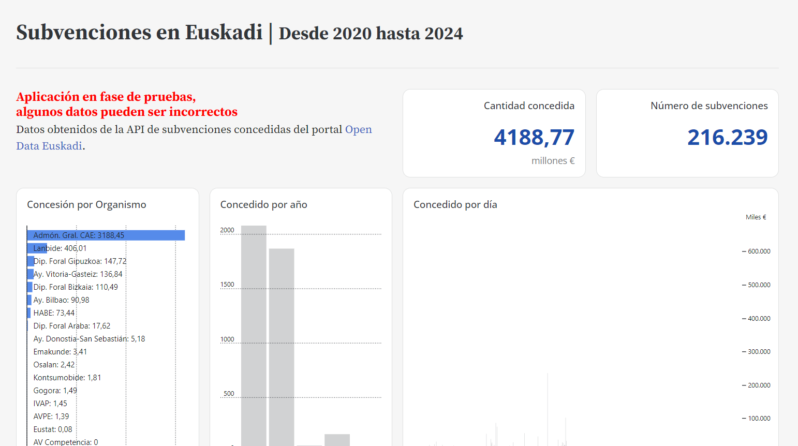

  

    <h1>Subvenciones en Euskadi</h1>
  

___

  
Bienvenidos a la plataforma de transparencia de GISteiz.

  

    <a href="/visor">
      

        
        Accede al visor
      

    </a>
  

